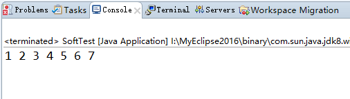
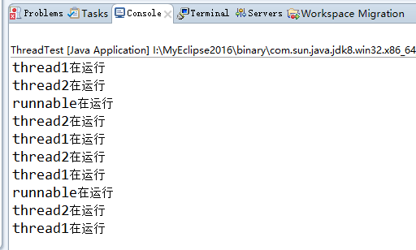

# Day1

## 自加理解

```java
int a = 3;
a = (a++) + 4;
//a = 7
```

等号优先级最低

过程如下：

1. a = (a++) + 4
2. a = (3++) + 4
3. a = 3 + 4
4. a++ //a=4
5. a = 7

## 冒泡排序

```java
public class SoftTest {
	public static void main(String[] args) {
		//冒泡排序
		int[] array = new int[]{1,3,5,7,2,4,6};
		int temp;
		for(int i = 0; i < array.length; i++){
			for(int j = i + 1; j < array.length; j++){
				if(array[i] > array[j]){
					temp = array[i];
					array[i] = array[j];
					array[j] = temp;
				}
			}
		}
		for(int i = 0; i < array.length; i++){
			System.out.print(array[i]+" ");
		}
	}
}
```


## 单例模式

```java
public class SingleInstanceTest {
	
	/**
	 * 懒汉式
	 */
	
	private static SingleInstanceTest instance;
	
	private SingleInstanceTest(){};
	
	public static synchronized SingleInstanceTest getInstance(){
		if(instance == null){
			instance = new SingleInstanceTest();
		}
		return instance;
	}
	
}
```

```java
public class SingleInstanceTest{
	
	/**
	 * 饿汉式
	 */
	
	private static final SingleInstanceTest instance = new SingleInstanceTest();
	
	private SingleInstanceTest(){}
	
	public static SingleInstanceTest getInstance(){
		return instance;
	}
}
```

```java
public class SingleInstanceTest{
	/**
	 * 
	 * 静态内部类
	 *
	 */
	private static class SingletonHolder{
		private static final SingleInstanceTest INSTANCE = new SingleInstanceTest();
	}
	private SingleInstanceTest(){}
	public static final SingleInstanceTest getInstance(){
		return SingletonHolder.INSTANCE;
	}
}
```

## 多线程

```java
public class ThreadTest {
	public static void main(String[] args) {
		Thread myThread1 = new MyThread("thread1");
		myThread1.start();
		Thread myThread2 = new MyThread("thread2");
		myThread2.start();
		MyRunnable myRunnable = new MyRunnable("runnable");
		Thread thread = new Thread(myRunnable);
		thread.start();
	}
}

class MyThread extends Thread{
	
	String name;
	
	public MyThread(String name){
		this.name = name;
	}
	
	@Override
	public void run() {
		while(true){
			try {
				System.out.println(name+"在运行");
				Thread.sleep(2000);
			} catch (InterruptedException e) {
				e.printStackTrace();
			}
		}
	}
}

class MyRunnable implements Runnable{
	
	private String name;
	
	public MyRunnable(String name) {
		this.name = name;
	}

	@Override
	public void run() {
		while(true){
			try {
				System.out.println(name+"在运行");
				Thread.sleep(4000);
			} catch (InterruptedException e) {
				e.printStackTrace();
			}
		}
	}
	
}
```

