# Day3

 **[HOME](../README.md)**

## SSH框架搭建

MyEclipse10  


### 创建WebProject

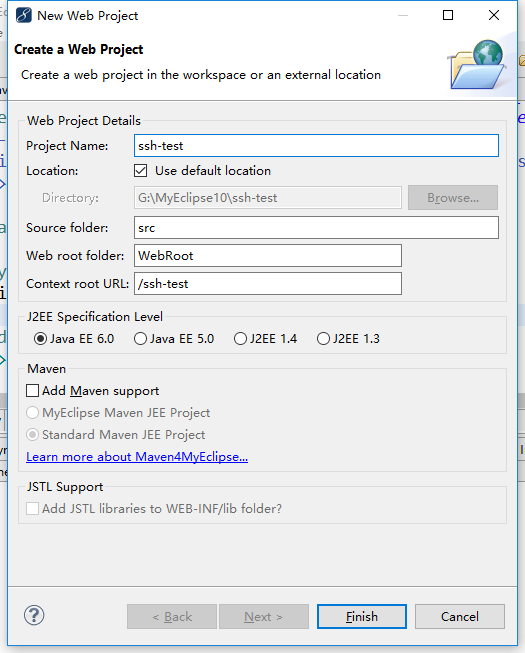

### 配置Struts2

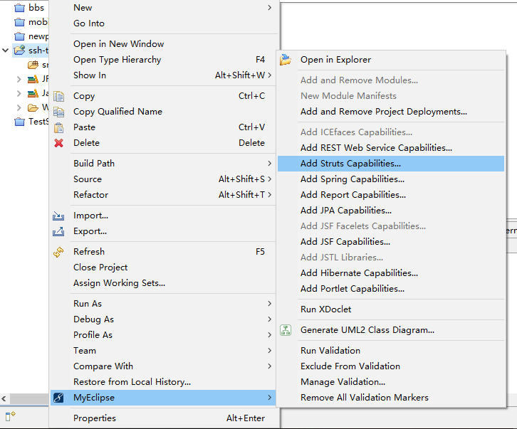

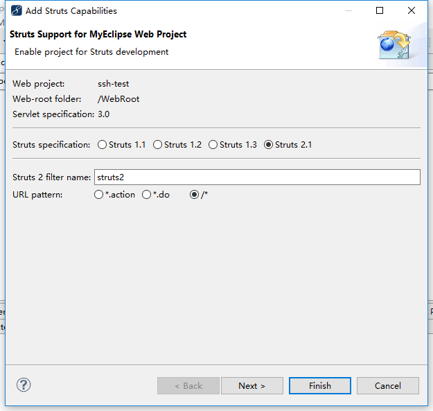

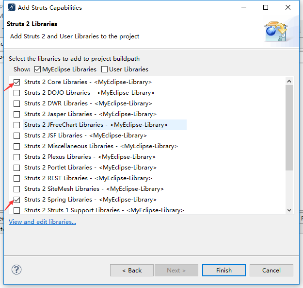

### 配置Spring

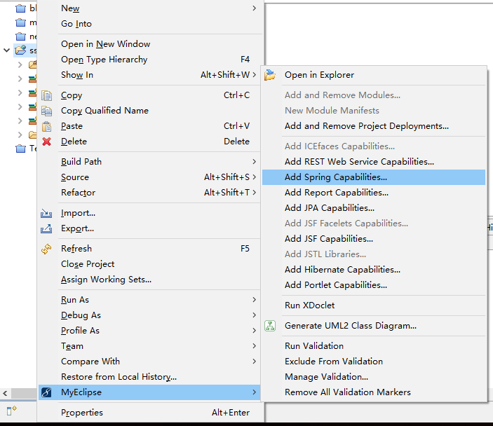

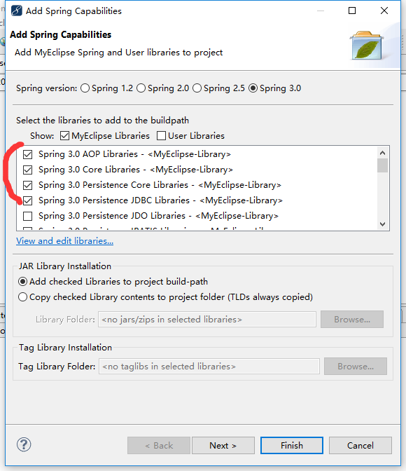

### 配置Hibernate


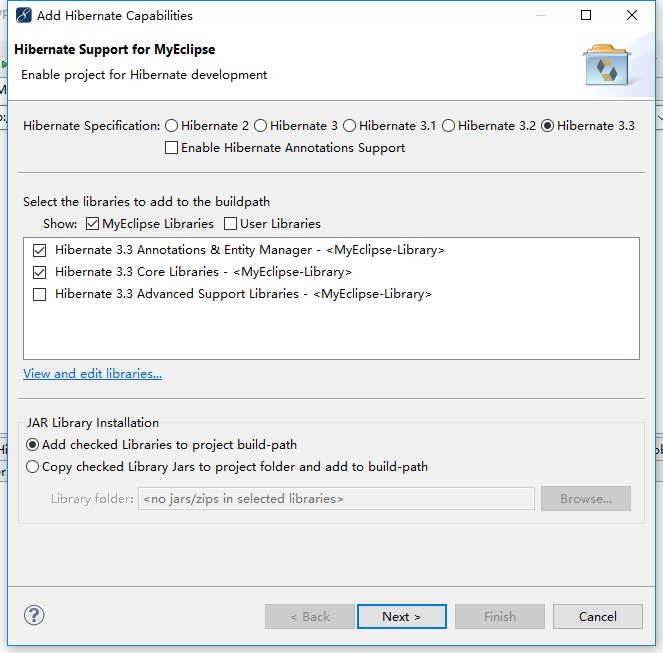


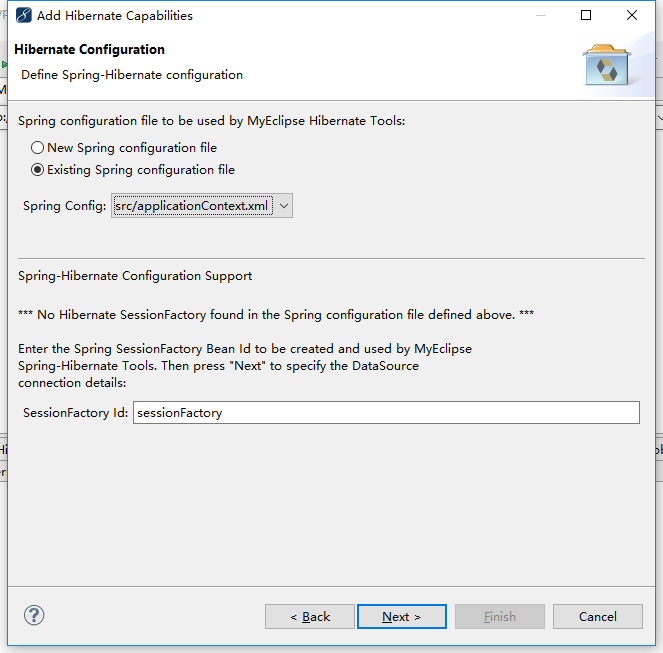

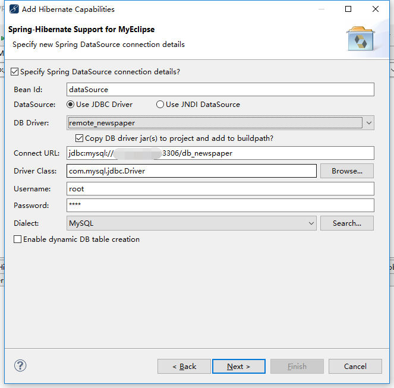

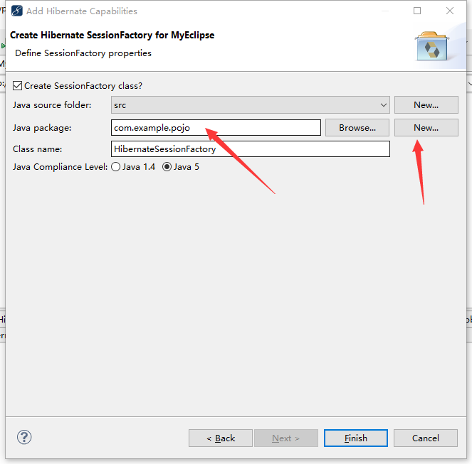

### 修改applicationContext.xml

```xml
<!-- 替换头部 -->
<?xml version="1.0" encoding="UTF-8"?>
<beans xmlns="http://www.springframework.org/schema/beans"
	xmlns:xsi="http://www.w3.org/2001/XMLSchema-instance"
	xmlns:tx="http://www.springframework.org/schema/tx"
	xmlns:aop="http://www.springframework.org/schema/aop"
	xmlns:context="http://www.springframework.org/schema/context"
	xsi:schemaLocation="   
  http://www.springframework.org/schema/aop     
  http://www.springframework.org/schema/aop/spring-aop-2.5.xsd   
  http://www.springframework.org/schema/beans     
  http://www.springframework.org/schema/beans/spring-beans-2.5.xsd   
  http://www.springframework.org/schema/context   
  http://www.springframework.org/schema/context/spring-context-2.5.xsd   
  http://www.springframework.org/schema/tx     
  http://www.springframework.org/schema/tx/spring-tx-2.5.xsd" default-autowire="byName">
	<context:annotation-config />
	<!-- 开启注解 -->
	<context:component-scan base-package="*" />


  
</beans>
```

### 修改web.xml

```xml
<?xml version="1.0" encoding="UTF-8"?>
<web-app version="3.0" 
	xmlns="http://java.sun.com/xml/ns/javaee" 
	xmlns:xsi="http://www.w3.org/2001/XMLSchema-instance" 
	xsi:schemaLocation="http://java.sun.com/xml/ns/javaee 
	http://java.sun.com/xml/ns/javaee/web-app_3_0.xsd">
  	...
  	...
  	...
  
    <listener>
      <listener-class>org.springframework.web.context.ContextLoaderListener</listener-class>
    </listener>
  
    <context-param>
      <param-name>contextConfigLocation</param-name>
      <param-value>classpath:applicationContext.xml</param-value>
    </context-param>
  </web-app>
```

### 根据数据表生成实体类
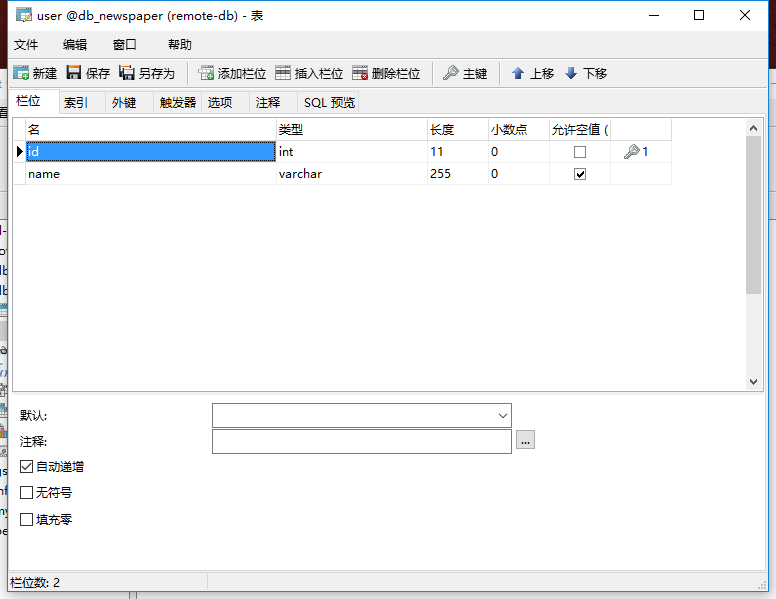

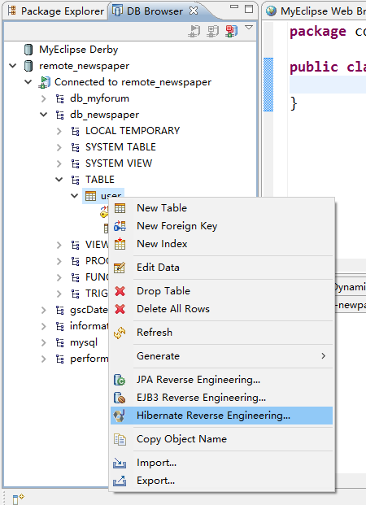

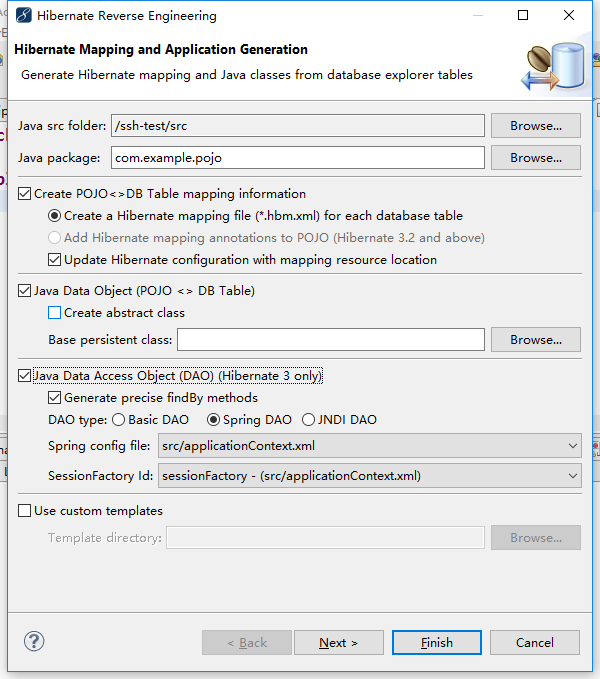

### 保存数据测试

**index.jsp**

```jsp
  <body>
    <a href="save?user.name=test">save</a>
  </body>
```

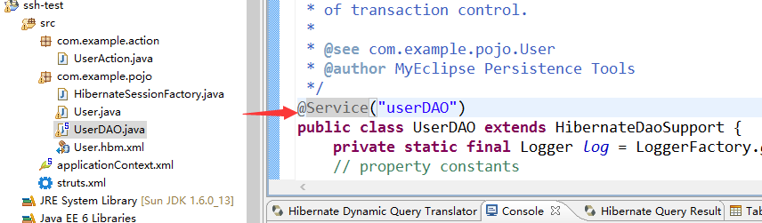

**UserAction.java**

```java
package com.example.action;

import javax.annotation.Resource;

import org.apache.struts2.convention.annotation.Action;

import com.example.pojo.User;
import com.example.pojo.UserDAO;

public class UserAction {
	User user;

	public User getUser() {
		return user;
	}

	public void setUser(User user) {
		this.user = user;
	}
	
	@Resource(name="userDAO")
	private UserDAO userDAO;
	
	@Action("save")
	public void save(){
		userDAO.save(this.user);
	}
	
}

```

